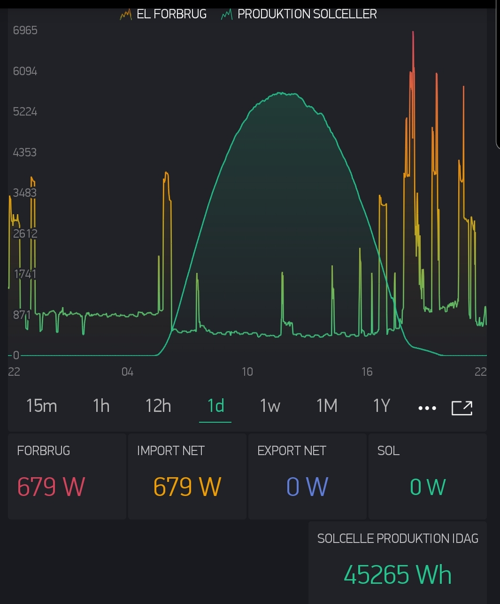

# Kamstrup-Radius-Blynk
ESP interface for Kamstrup electricity meter.

The sketch will only work on Kamstrup OMNIPOWER electricity meter located in Denmark.

Before you start you will need to get 2 encryption key from the electricity supplier.

# BOM:

esp32 lolin

# Connections:

Connect the Data_Out tx from the meter to pin IO 16 on the ESP32.

Connect the GND from the meter to GND pin the ESP32.

